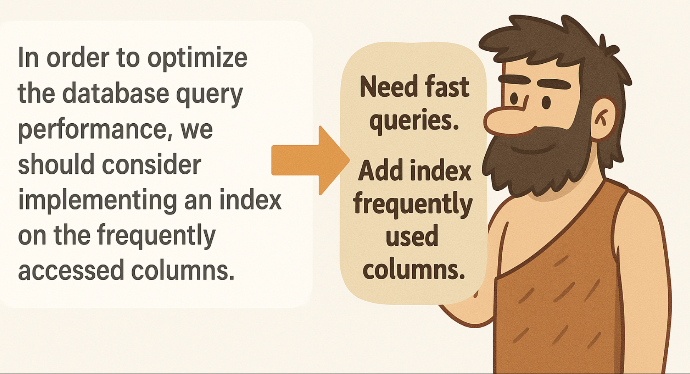

<div align="center">


**Lossless semantic compression for LLM contexts**

[](https://opensource.org/licenses/MIT)
[](https://www.python.org/downloads/)

[Quick Start](#quick-start) • [Examples](#examples) • [Benchmarks](#benchmarks) • [Spec](SPEC.md)

</div>

---

## What is this?

Strip grammar. Keep facts. Save tokens.

```diff
- "In order to optimize the database query performance, we should consider implementing an index on the frequently accessed columns..." (70 tokens)
+ "Need fast queries. Check which columns used most. Add index to those columns..." (50 tokens)

= 29% reduction
```

---

## How It Works



LLMs excel at filling linguistic gaps. They predict missing grammar, connectives, and structure.

**Key insight:** We remove only what LLMs can reliably reconstruct.

**What we remove (predictable):**
- Grammar: "a", "the", "is", "are"
- Connectives: "therefore", "however", "because"
- Passive constructions: "is calculated by"
- Filler words: "very", "quite", "essentially"

**What we keep (unpredictable):**
- Facts: numbers, names, dates
- Technical terms: "O(log n)", "binary search"
- Constraints: "medium-large", "frequently accessed"
- Specifics: "Stockholm", "99.9% uptime"

**Why no hallucination:**
The compressed version contains all semantic content. When decompressing, the LLM reconstructs grammar around preserved facts—it cannot hallucinate details that are already specified.

```
Compressed: "Company medium-large. Location Stockholm."
Decompressed: "at a medium-large company based in Stockholm"
           ↑ grammar added, facts unchanged ↑
```

---

## Quick Start

### Installation

```bash
python3 -m venv venv
source venv/bin/activate
pip install -r requirements.txt
```

### Usage

**Compress:**
```bash
python caveman_compress.py compress "Your verbose text here"
```

**Decompress:**
```bash
python caveman_compress.py decompress "Caveman text here"
```

**From file:**
```bash
python caveman_compress.py compress -f input.txt -o output.txt
```

---

## Examples

### Resume

<table>
<tr>
<td width="50%"><b>Normal (201 tokens)</b></td>
<td width="50%"><b>Caveman (156 tokens)</b></td>
</tr>
<tr>
<td>

I am John Smith, a 32-year-old Senior Software Engineer at a large enterprise software company based in San Francisco, California. I have over 8 years of experience in backend development, distributed systems, and database optimization. Throughout my career, I have successfully designed and implemented scalable microservices...

</td>
<td>

John Smith. 32 years old. Senior Software Engineer. Large enterprise software company. San Francisco, California. 8 years experience. Backend development, distributed systems, database optimization. Designed scalable microservices. 50 million requests daily...

</td>
</tr>
<tr>
<td colspan="2" align="center"><b>22% reduction</b></td>
</tr>
</table>

### System Prompt

<table>
<tr>
<td width="50%"><b>Normal (171 tokens)</b></td>
<td width="50%"><b>Caveman (72 tokens)</b></td>
</tr>
<tr>
<td>

You are a helpful AI assistant designed to provide accurate and concise responses to user queries. When answering questions, you should always prioritize clarity and correctness over speed. If you are uncertain about any information, you must explicitly state your uncertainty...

</td>
<td>

Helpful AI assistant. Provide accurate, concise responses. Prioritize clarity, correctness. If uncertain, state uncertainty. Break complex problems into smaller steps. Explain reasoning clearly...

</td>
</tr>
<tr>
<td colspan="2" align="center"><b>58% reduction</b></td>
</tr>
</table>

### API Documentation

<table>
<tr>
<td width="50%"><b>Normal (137 tokens)</b></td>
<td width="50%"><b>Caveman (79 tokens)</b></td>
</tr>
<tr>
<td>

To authenticate with our API, you need to include your API key in the Authorization header of every request. The API key should be prefixed with the word "Bearer" followed by a space. If authentication fails, the server will return a 401 Unauthorized status code...

</td>
<td>

Authenticate API. Include API key in Authorization header every request. Prefix API key with "Bearer" space. Authentication fail, server return 401 Unauthorized status code, error message explain fail...

</td>
</tr>
<tr>
<td colspan="2" align="center"><b>42% reduction</b></td>
</tr>
</table>

---

## Benchmarks

| Test Case | Original | Compressed | Reduction |
|-----------|----------|------------|-----------|
| System prompt | 171 tokens | 72 tokens | **58%** |
| API documentation | 137 tokens | 79 tokens | **42%** |
| Resume | 201 tokens | 156 tokens | **22%** |
| **Average** | **170** | **102** | **40%** |

All examples validated with GPT-4o. See [examples/](examples/) for full text.

---

## Core Principles

1. **Strip connectives** - Remove: therefore, however, because, in order to
2. **2-5 words per sentence** - One atomic thought per sentence
3. **Action verbs** - Prefer: do, make, fix, check vs facilitate, optimize
4. **Be concrete** - "test five, test six" not "test values 5-6"
5. **Active voice** - "calculate value" not "value is calculated"
6. **Keep meaningful info** - Numbers, sizes, names, constraints stay

See [SPEC.md](SPEC.md) for full rules.

---

## When to Use

✅ **Good for:**
- LLM reasoning/thinking blocks
- Token-constrained contexts
- Internal documentation
- Step-by-step instructions

❌ **Avoid for:**
- User-facing content
- Marketing copy
- Legal documents
- Emotional communication

---

## Documentation

- [SPEC.md](SPEC.md) - Full specification and rules
- [examples/](examples/) - Before/after samples
- [prompts/compression.txt](prompts/compression.txt) - System prompt for compression
- [prompts/decompression.txt](prompts/decompression.txt) - System prompt for decompression

---

## Contributing

Contributions welcome. Submit issues or PRs.

---

## License

MIT

---

## Author

**William Peltomäki**

---

Inspired by [TOON](https://github.com/toon-format/toon) and the token-optimization movement.
